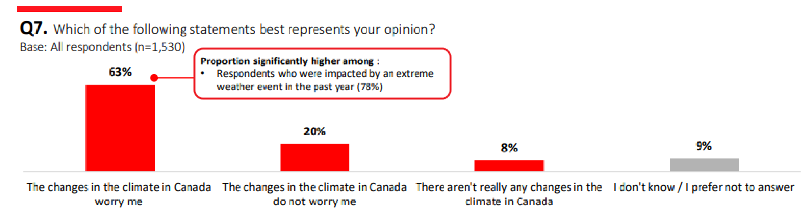
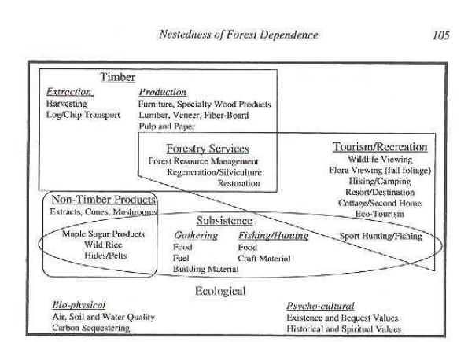

# I. Anatomy of Conflict 

## Subjective phenomena, as opposed to what?

## Social construction means anything goes?

## Are all experiences, meanings, preferences equally valid?”

## What is Power?

the capacity to impose a specific definition of reality which is disadvantageous to others or to limit other’s autonomy. Could be a imposition of a specific *landscape*

# II. Science, Politics and Environmental Controversies

## Based on the linear model of science, what are the sources of conservation conflicts?

## What does Bjorn Lomborg and his critics tell us about the role of science in understanding environmental problems?

## What is the excess of objectivity, with examples from the readings

## With examples from oceanographers and GMO scientists, what is the role of values in science?

## What is meant by a normative framework?

<a href="zotero://open-pdf/library/items/CLJHG3ZD?page=2&#x26;annotation=M4LBWMUF">“For Lovejoy, the process starts when “researchers identify a potential problem,” but the recognition that something is a “problem” demands a pre-existing framework of values and interests within which problems can be recognized. And Pimentel’s “wary outlook” (not to mention Lomborg’s rosy one) presupposes some expectations of what the world ought to look like in the first place.”</a> (<a href="zotero://select/library/items/472F775J">Sarewitz, 2004, p. 386</a>)

<a href="zotero://open-pdf/library/items/CLJHG3ZD?page=8&#x26;annotation=EXCFIPUZ">“This alignment of disciplinary perspective and worldly interests is critically important in understanding environmental controversies, because it shows that stripping out conflicts of interest and ideological commitments to look at “what the science is really telling us” can be a meaningless exercise.”</a> (<a href="zotero://select/library/items/472F775J">Sarewitz, 2004, p. 392</a>)

<a href="zotero://open-pdf/library/items/CLJHG3ZD?page=8&#x26;annotation=LSGPPK75">“it might be most accurate to look at the scientific debate not as tainted by values and interests, but as an explicit—if arcane—negotiation of the conflict between competing values and interests embodied by competing disciplines.”</a> (<a href="zotero://select/library/items/472F775J">Sarewitz, 2004, p. 392</a>)

<a href="zotero://open-pdf/library/items/CLJHG3ZD?page=8&#x26;annotation=GJTT9SAR">“To summarize thus far: central to the idea that science can help resolve environmental controversies is the expectation that science can help us understand current conditions under which our decisions are being made, and the potential future consequences of those decisions. This expectation must confront the proliferation of available facts that can be used to build competing pictures of current and future conditions, and the embeddedness of such facts in disciplinary perspectives that carry with them normative implications.”</a> (<a href="zotero://select/library/items/472F775J">Sarewitz, 2004, p. 393</a>)

## Based on the political model of science, what are the sources of environmental conflict?

## What is the role of scientists and scientific evidence in conflict?

## Is there evidence of linear or political models of science?

## Is there evidence of technocratic, decisionistic or pragmatic approaches to decision making?

<a href="zotero://open-pdf/library/items/QVX48GFC?page=7&#x26;annotation=EGXXKCHN">“An early concern in the [ALBERTA LAND-USE FRAMEWORK] case was the structure and composition of this small, influential group of individuals who served on the [Regional Advisory Commity (RAC)]. The apparent conflicts of interests in having an RAC chair that was also employed by big oil did not go unnoticed by local public intellectuals (e.g., Sheila Pratt, “Stelmach’s political judgment lacking in civil service appointment,” Edmonton Journal 20 August 2007, A:18). Moreover, the RAC was invited by the land-use secretariat to consider the impact of three economic development scenarios for the region. These scenarios were narrowly defined in terms of three levels of oil sands production (low, medium, and high), for which the lowest level of production was 2 million barrels/day (approximately status quo) and the highest level of production was 6 million barrels/day.”</a> (<a href="zotero://select/library/items/ZW8EKDW3">Parkins, 2011, p. 7</a>)

## Are the organizations and actors of impact assessment set up to favor one particular approach?

## What is a social movement organization?

Diani, M. - "a network of informal interactions between a plurality of individuals, groups and/or organizations, engaged in a political or cultural conflict, on the basis of a shared collective identity"

Types: (Older Political) Class, race, (Newer Cultural) identify, equity

## What are the Core Framing Tasks?

\
(<a href="zotero://select/library/items/FTGFTPEB">Parkins, 2024, p. 16</a>)

## What are Collective Action Frames?

\
(<a href="zotero://select/library/items/8QS3NV8S">Benford and Snow, 2000, p. 613</a>)

\
(<a href="zotero://select/library/items/8QS3NV8S">Benford and Snow, 2000, p. 614</a>)

## What are the dimensions of collective action frames?

1.  **Problem Identification, Locus of Attribution.** The most obvious way in which collective action frames vary is in terms of the problems or issues addressed and the corresponding direction of attribution.

2.  **Flexibility and Rigidity, Inclusivity and Exclusivity. **Collective action frames may vary in the degree to which they are relatively exclusive, rigid, inelastic, and restricted or relatively inclusive, open, elastic, and elaborated in terms of the number of themes or ideas they incorporate and articulate

3.  **Variation in Interpretive Scope and Influence**

4.  **Resonance:**

    1.  **Frame Credibility**

        1.  <u>Frame Consistency</u>

            refers to the congruency between an SMO's beliefs, claims, and actions.

        2.  <u>Empirical Credibility</u>

            refers to the apparent fit between the framings and events in the world.

        3.  <u>Credibility of the Claimsmaker</u>

    2.  **Relative Salience**

        1.  <u>Centrality</u>

            has to do with how essential the values, and ideas associated with movement frames are to the lives of the targets of mobilization.

        2.  <u>Experiential commensurability</u>

            is when the framining is consistent with the personal experiences of the target.

        3.  <u>Narrative Fidelity</u>

            is how well the frame firts with the existing cultural myths, ethos, or inherent ideology.

## What contributes to resonance and salience?

(see above)

## Examples of “Diagnostic Frame Disputes”

\
(<a href="zotero://select/library/items/DT83TUJG">Krogman, 1996, p. 13</a>)

## Examples of “Representative Anecdotes

\
(<a href="zotero://select/library/items/DT83TUJG">Krogman, 1996, p. 18</a>)

## Examples of “Diversionary Reframing”

\
(<a href="zotero://select/library/items/DT83TUJG">Krogman, 1996, p. 22</a>)

## In the meta-analysis of climate change belief factors, what are the main take-aways?

|                                                        |                                                                               |                           |
| ------------------------------------------------------ | ----------------------------------------------------------------------------- | ------------------------- |
| **Predictor (Sorted by decreasing explanatory power)** | **Effect on the four belief dimension**                                       | **Theoretical Framework** |
| **Pro-environment beliefs**                            | Strongly positive, consistent                                                 | Values-Beliefs-Norms      |
| **Political ideology / Political affilition**          | Left -> Positive Right -> Negative                                            | Anti-reflexivity Thesis   |
| **Gender**                                             | Women higher in belief and concern than men, third of studies not signficiant | Gender Socialization      |
| **Age, Postmaterialist Values, Egalitarianism**        | Generally poor predictors, mixed results                                      | multiple, but not valid   |

## How does climate vulnerability and exposure impact climate change views

## Where does the anti-reflexivity thesis fit within the anatomy of conflict?

**Political Dimension: **Groups with vested interests in capitalist industrial system seek to maintain status quo.

**Social Dimension: **Cultural symbols and landscapes based on sociocultural identities of oil field workers, ranchers, petro-masculinity etc.

## Notes on the CBC Podcast: *Decoding the Resistance (Naomi Oreskes)*

*   Denial is highly funded by large industrialists

    *   **Climate denial** is not anti-environment, it’s **anti-regulation.** This is why it receives so much support from industries with the most to lose by being regulated for the negative externalities they cause (Tobacco, Petroleum)
    *   this explains the right-left predictors because *right *is associated with free-market deregulation
    *   scientists are being attacked because they discovered **market failures** (DDT, air pollution, climate change, acid rain, tobacco, ozone holes, etc..)

*   “It’s not an argument about science, it’s an argument about **governance**“. This is a key point; people fear that if they accept the climate problem, that means they must accept regulation of personal freedoms or global governance.** Slippery slope** argument -> Communism via the “back door”.

*   **Cold War Connection: **scientists involved in US government in 80s all had worked in military projects and were highly connected to military strategy of the *Strategic Defense Initiative*, aka “Star Wars” (no Megan, not that *Star Wars) *under Reagan. Working on missile programs. Generally peddled “doubt” to fight perceived “socialist/communist” critiques of american industrialism and military power.

*   **Watermelons: **Naomi critiques the idea that environmentalists are “green on the outside by red on the inside” by showing that the origins of environmental movement in the US were bipartisan and included some huge industrialists.

*   **Her Big Question: **If the issue is not climate denial but people not “liking the solutions” to climate problems, **could we find better solutions?**

    *   “the purpose of government is to balance different interpretations of freedom”. The issues is the meaning and symbol of freedom has different meanings for different **social groups.**
    *   If people are in denial, try to understand “**what is the blockage?”**
    *   **Equity **in distribution of climate costs (carbon taxes affecting some communities more than others for example)

## Clayoquot Sound: The Last Battlefield - The Fifth Estate (1993)

*   “Summer of failure for the environmental movement”. This case study is an example of effective countermovement by the industry

*   2/3 cut, 1/3 preserve “comprimise” plan

*   **SHARE movement.** MacMillian Bloedel hired PR firms and followed examples of US countermovements to communities effected by logging conflict. Funding the SHARE movement, based off the Wise-Use movement in the US.

*   creator of the WISE movement uses same reframing as in the CBC podcast - claims the movement is really about communism or dismantling the capitalist system, not the environment.

*   **Forest Alliance of BC. **To fight bad image and mobilize public opinion to keep the forest land base under industrial control. PR firm that created FABC also advised Exxon on the Valdez.

    *   Patrick Moore: biggest question is whether the organization is **reformative **or **reactionary, **not whether it is partisan (it is)

*   Diversionary reframing: “will take away jobs”

    *   Response: Jobs lost by mechanization, not environmental movement (CEO MacBlo)

*   social/political: **rural vs urban, white-collar vs blue-collar**

## What are the potential problems with this approach to preservation through Indigeneity?

*   presupposes that indigenity is alway aligned with a preservationist attitude

*   indigeniety is only considered “good” if it aligns with those principles or their historic way of life.

*   could take an ecological issue and turn it into an identity issue

*   could take existing rights struggle (land claims) and “depoliticize” it into an ecological one.

*   *nature* conflated with *traditional* conflated with *indigenous *and *primitivism*

*   <a href="zotero://open-pdf/library/items/2ZUVVTT4?page=48&#x26;annotation=TVUQ4J52">“Social construction of Clayoquot Sound elevates wilderness / tradition but also erases contemporary use and cultural practice as modern”</a>

    (<a href="zotero://select/library/items/8HNX2DNR">Parkins, 2024, p. 48</a>)

## What is meant by the term *Post-Colonial Environmentalism*

*   environmentalism as informed by recent colonial practices. Problematic as it may seek to continue colonial practices through disenfranchizing indigenous people from their land in the name of conservation. Perhaps a synonym is  “ecologized colonialism”.

## How is a managerial approach used to depoliticize forest conflict?

*   example in *Stumped. *Claiming clearcutting mimics an ecological process. This could also be an example of ecologization.

## How is the populist approach used to depoliticize the conflict?

*   SHARE groups and other grassroots advocates of forestry industry characterizing the preservationist point of view as radical

## What is “delinking” of industry and community success in forestry?

*   companies still profiting, exports as high as ever, but communities dependent on sector are continually declining, sector jobs declining

## Possible solutions to forest sector problems?

*   **Community Forests: **managed locally rather than by state agency with

    <u>local</u>

    benefit in mind. This is kind of a “private property” solution where the community owns it instead of the federal government. **Definition: **

    <a href="zotero://open-pdf/library/items/2ZUVVTT4?page=23">“A public forest area managed by the community as a working forest for the benefit of the community”</a>

    (<a href="zotero://select/library/items/8HNX2DNR">Parkins, 2024, p. 23</a>)

*   **Consider Nestedness* ***of forest dependence:\
    

## What are the general attirbutes of a Community Forest?

*   Decision making and control that is separate from state forestry agencies
*   Natural and plantation forest management for local benefits
*   Multiple-use management
*   Long-term ecological health

## What is Public Participation?

<a href="zotero://open-pdf/library/items/2ZUVVTT4?page=26&#x26;annotation=SDNKEVWD">“Various forms of direct public involvement where people, individually or through organized groups, can exchange information, express opinions and articulate interests, and have the potential to influence decisions or the outcome of specific forestry issues.”</a> (<a href="zotero://select/library/items/8HNX2DNR">Parkins, 2024, p. 26</a>) ...especially the **"potential to influence**" aspect

## What are some issues frequently encountered in Public Participation?

*   process has been captured by experts or industry
*   public representatives not always representative of the public at large
